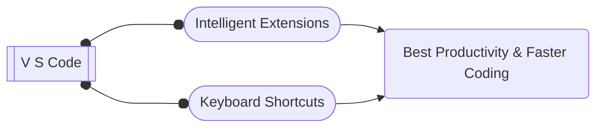

 
Visual Studio Code is a lightweight and very powerful source code editor. VS Code extensions feature let’s you add languages, debuggers and tools to your installation to support your development workflow. 

💪 Boost productivity with these amazing VS Code extensions. 🚀🚀🚀

    
| 📍      | Extension | Publisher| Snippet |
|  ---      | :---      | :---     |  :---   |
| | [Prettier Code Formatter](https://marketplace.visualstudio.com/items?itemName=esbenp.prettier-vscode) | Prettier | Code formatter using prettier |
| | [Live Server](https://marketplace.visualstudio.com/items?itemName=ritwickdey.LiveServer) |Ritwick Dey |Launch a development local Server with live reload feature for static & dynamic pages |
| | [VSCode Icons](https://marketplace.visualstudio.com/items?itemName=vscode-icons-team.vscode-icons) |VSCode Icons Team |Icons for Visual Studio Code |
| | [Bracket Pair Colorizer](https://marketplace.visualstudio.com/items?itemName=CoenraadS.bracket-pair-colorizer) |CoenraadS |A customizable extension for colorizing matching brackets |
| | [Auto Rename Tag](https://marketplace.visualstudio.com/items?itemName=formulahendry.auto-rename-tag) |Jun Han |Auto rename paired HTML/XML tag |
| | [ES7+ React/Redux/React-Native snippets](https://marketplace.visualstudio.com/items?itemName=dsznajder.es7-react-js-snippets) | D Sznajder |Extensions for React, React-Native and Redux in JS/TS with ES7+ syntax. Customizable. Built-in integration with prettier.|
| | [Thunder Client](https://marketplace.visualstudio.com/items?itemName=rangav.vscode-thunder-client) |Ranga Vadhineni | Lightweight Rest API Client for VS Code|
| | [Tailwind CSS IntelliSense](https://marketplace.visualstudio.com/items?itemName=bradlc.vscode-tailwindcss) | Tailwind Labs |Intelligent Tailwind CSS tooling for VS Code |
| | [Material Icon Theme](https://marketplace.visualstudio.com/items?itemName=PKief.material-icon-theme) | Philipp Kief |Material Design Icons for Visual Studio Code |
| | [Live Sass Compiler](https://marketplace.visualstudio.com/items?itemName=ritwickdey.live-sass) | Ritwick Dey |Compile Sass or Scss to CSS at realtime with live browser reload.|
| | [VSCode Styled Components](https://marketplace.visualstudio.com/items?itemName=styled-components.vscode-styled-components) | Styled Components | Syntax highlighting for styled-components | 
| | [Emoji Sense](https://marketplace.visualstudio.com/items?itemName=bierner.emojisense) | Matt Bierner | Adds suggestions and autocomplete for emoji | 
| | [Peacock](https://marketplace.visualstudio.com/items?itemName=johnpapa.vscode-peacock) | John Papa | Subtly change the workspace color of your workspace. Ideal when you have multiple VS Code instances and you want to quickly identify which is which. | 
| | [Quokka.js](https://marketplace.visualstudio.com/items?itemName=WallabyJs.quokka-vscode) | Wallaby.js | JavaScript and TypeScript playground in your editor |
| | [ESLint](URL) | Microsoft | Integrates ESLint JavaScript into VS Code. |
| | [Regex Previewer](https://marketplace.visualstudio.com/items?itemName=chrmarti.regex) | Christof Marti | Regex matches previewer for JavaScript, TypeScript, PHP and Haxe in Visual Studio Code. | 
| | [GitLens — Git supercharged](https://marketplace.visualstudio.com/items?itemName=eamodio.gitlens) | GitKraken | Supercharge Git within VS Code — Visualize code authorship at a glance via Git blame annotations and CodeLens, seamlessly navigate and explore Git repositories, gain valuable insights via rich visualizations and powerful comparison commands, and so much more |
| | [Better Comments](https://marketplace.visualstudio.com/items?itemName=aaron-bond.better-comments) | Aaron Bond | Improve your code commenting by annotating with alert, informational, TODOs, and more! |
| | [Live Share](https://marketplace.visualstudio.com/items?itemName=MS-vsliveshare.vsliveshare) | Microsoft | Real-time collaborative development from the comfort of your favorite tools. |  
| | [Docker](https://marketplace.visualstudio.com/items?itemName=ms-azuretools.vscode-docker) | Microsoft | Makes it easy to create, manage, and debug containerized applications. | 
| | [SVG Previewer](https://marketplace.visualstudio.com/items?itemName=vitaliymaz.vscode-svg-previewer) | Vitalii Mazurenko | Show SVG preview to the side panel |
| | [GitHub Repositories](https://marketplace.visualstudio.com/items?itemName=github.remotehub) | GitHub | Remotely browse and edit any GitHub repository | 
| | [Inline fold](https://marketplace.visualstudio.com/items?itemName=moalamri.inline-fold) | Mohammed Alamri | A custom decorator that "fold" matching content in single line |  
| | [JavaScript and TypeScript Nightly](https://marketplace.visualstudio.com/items?itemName=ms-vscode.vscode-typescript-next) | Microsoft | Enables typescript@next to power VS Code's built-in JavaScript and TypeScript support | 
| | [Multiple cursor case preserve]([URL](https://marketplace.visualstudio.com/items?itemName=Cardinal90.multi-cursor-case-preserve)) | Cardinal90 | Preserves case when editing with multiple cursors | 

<!--Copy below commented markdown code line above, then fill all required fields, uncomment, preview and contribute : -->
<!-- | | [Name](URL) | Publisher | Snippet | --> 

## Official
 - VS Code: https://code.visualstudio.com/
 - Extensions: https://marketplace.visualstudio.com/VSCode

